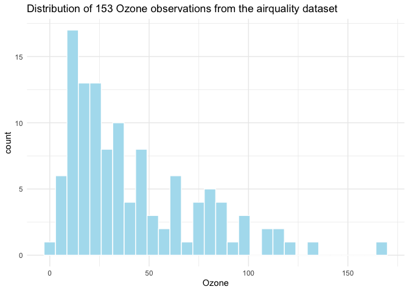
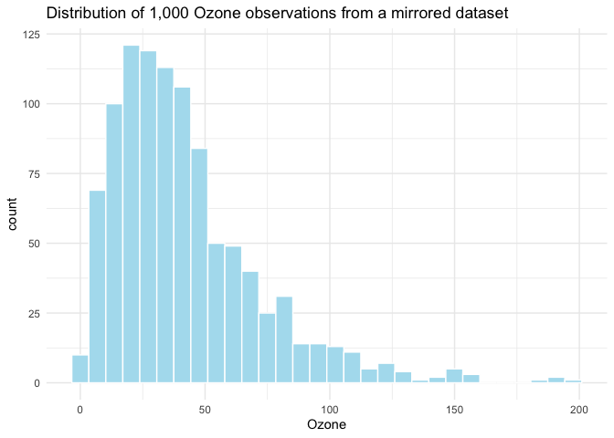

<!-- README.md is generated from README.Rmd. Please edit that file -->

# dfmirroR

<!-- badges: start -->
<!-- badges: end -->

The goal of dfmirroR is to create mirrored version of data sets *and*
output a string with the code to reproduce that copy. Data scientists
often have questions about analyzing a specific data set, but in many
cases cannot share their data.

*dfmirrorR* creates a copy of the data based on the distribution of
specified columns. In recognition that we also often have questions we
want to post publicly, and the need to create producable examples, the
package also has functionality for outputting a simplified, pasteable
version of code for creating the mirrored data frame object.

One neat thing about dfmirrorR is that it tests whether or not columns
are normally distributed and mirrors the specified columns accordingly
so that your “fake” data resembles your original data.

## Installation

You can install the development version of dfmirroR from
[GitHub](https://github.com/) with:

``` r
# install.packages("devtools")
devtools::install_github("jacobpstein/dfmirroR")
```

## Example

This is a basic example which shows you how to solve a common problem.
Let’s say you are working with the `airquality` dataset. This contains a
`Temp` column that is approximately normal based on a basic Shapiro-Wilk
test and another column `Ozone`, which is non-normally distributed. You
want to simulate a data set to test a model and need to mirror
`airquality` but with more observations and then create a reproducible
example.

Here’s what the `Ozone` column looks like in the original data:

``` r
library(dfmirroR)
library(ggplot2)

data(airquality)

# take a look at the Ozone variable

ggplot(airquality) +
  geom_histogram(aes(Ozone), col = "white", fill = "#AFDFEF") +
  theme_minimal() +
  labs(title = "Distribution of 153 Ozone observations from the airquality dataset")
#> `stat_bin()` using `bins = 30`. Pick better value with `binwidth`.
#> Warning: Removed 37 rows containing non-finite values (`stat_bin()`).
```



Now, let’s run `dfmirrorR` to create a similar column.

``` r

air_mirror <- simulate_dataframe(airquality, num_obs = 1000, columns_to_simulate = c("Ozone", "Temp"))
```

This creates a `list()` object that contains a new data frame with 1,000
observations based on the distributions of the `Ozone` and `Temp`
columns in the `input_df`.

Take a look at the mirrored colum for Ozone:

``` r

ggplot(air_mirror$simulated_df) +
  geom_histogram(aes(Ozone), col = "white", fill = "#AFDFEF") +
  theme_minimal() +
  labs(title = "Distribution of 1,000 Ozone observations from a mirrored dataset")
#> `stat_bin()` using `bins = 30`. Pick better value with `binwidth`.
#> Warning: Removed 18 rows containing non-finite values (`stat_bin()`).
```



## Print code to share your simulated data

There are other packages that can mirror a dataframe. The excellent
[`faux`](https://debruine.github.io/faux/) comes to mind. However, one
addition of the `dfmirroR` package is that it prints code to add to a
reproducible example if you need to ask a question on Stackoverflow or
elsewhere.

For example, from our `air_mirror` list object above, we can extract the
`code` object, which is just a string containing the relevant code.
Combining this object with the `cat()` function provides clean, easily
shareable output.

``` r

cat(air_mirror$code)
#> simulated_df <- data.frame(
#>   Ozone = sample(c(41, 36, 12, 18, NA, 28, 23, 19, 8, 7, 16, 11, 14, 34, 6, 30, 1, 4, 32, 45, 115, 37, 29, 71, 39, 21, 20, 13, 135, 49, 64, 40, 77, 97, 85, 10, 27, 48, 35, 61, 79, 63, 80, 108, 52, 82, 50, 59, 9, 78, 66, 122, 89, 110, 44, 65, 22, 31, 168, 73, 76, 118, 84, 96, 91, 47, 24, 46), 1000, replace = TRUE),
#>   Temp = sample(c(67, 72, 74, 62, 56, 66, 65, 59, 61, 69, 68, 58, 64, 57, 73, 81, 79, 76, 78, 84, 85, 82, 87, 90, 93, 92, 80, 77, 75, 83, 88, 89, 91, 86, 97, 94, 96, 71, 63, 70), 1000, replace = TRUE)
#> )
```
